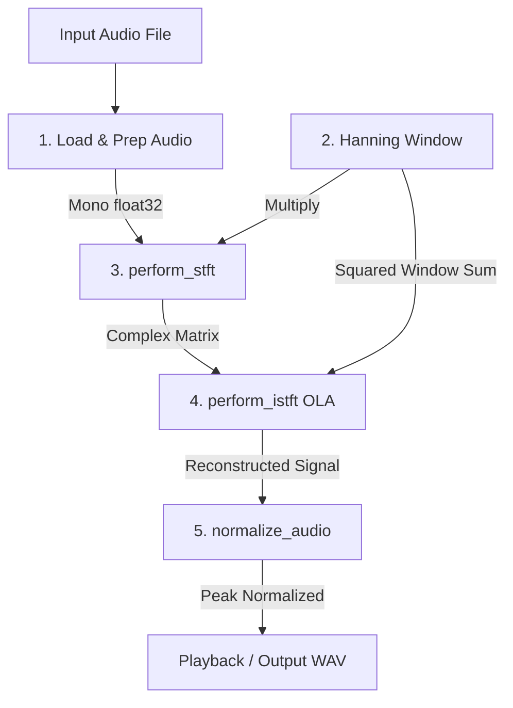

# Phase Vocoder Milestone 1: Analysis, Reconstruction & Interactive UI

This document explains the technical implementation of **Milestone 1** of the Phase Vocoder project, covering the DSP backend (`milestone_1.py`) and the interactive Streamlit interface (`app.py`).

---

## 1. What `milestone_1.py` is doing

The backend module implements a complete, mathematically clean Short-Time Fourier Transform (STFT) analysis and Inverse STFT (ISTFT) synthesis loop. The primary objective of this stage is to achieve **perfect reconstruction** (transparent audio quality with near-zero error).

### The DSP Pipeline Flow

### Core Functions & Math

#### 1. Audio Prep (`load_and_prep_audio`)
*   Loads raw audio using `soundfile`.
*   Down-mixes stereo signals to mono by calculating the channel average (equal-power down-mix):
    $$x_{\text{mono}}[n] = \frac{1}{C}\sum_{c=1}^C x_c[n]$$
*   Casts the signal to contiguous `float32` arrays in the range `[-1.0, 1.0]`.

#### 2. Window Generation (`create_hanning_window`)
*   Generates a symmetric raised-cosine Hanning window to taper the frame boundaries and prevent spectral leakage:
    $$w[n] = 0.5 \cdot \left(1 - \cos\left(\frac{2\pi n}{N - 1}\right)\right), \quad 0 \le n < N$$
    where $N$ is the `frame_size`.

#### 3. STFT Analysis (`perform_stft`)
*   Segments the signal into overlapping frames of size $N$ shifted by $R$ (`hop_size`).
*   Applies the Hanning window element-wise.
*   Calculates the Real Fast Fourier Transform (`np.fft.rfft`), keeping only the non-redundant positive frequency bins ($N/2 + 1$ bins):
    $$X[k, m] = \sum_{n=0}^{N-1} x[mR + n] \cdot w[n] \cdot e^{-j \frac{2\pi}{N} k n}$$

#### 4. ISTFT Overlap-Add Synthesis (`perform_istft`)
*   Applies the Inverse Real FFT (`np.fft.irfft`) to map frequency spectra back to the time-domain.
*   Applies WOLA (Weighted Overlap-Add) reconstruction: overlays frames and divides each sample by the sum of the squared window values at that position to remove amplitude modulations:
    $$y[n] = \frac{\sum_{m} y_m[n - mR] \cdot w[n - mR]}{\sum_{m} w^2[n - mR]}$$
*   Trims or pads the signal to match the exact input sample length.

#### 5. Normalization (`normalize_audio`)
*   Prevents digital clipping by scaling the output amplitude peak to safely fit within $0.99$ headroom:
    $$x_{\text{normalized}}[n] = \frac{x[n]}{\max(|x|)} \cdot 0.99$$

---

## 2. What `app.py` is doing

The Streamlit application (`app.py`) wraps the backend code into an interactive, high-fidelity web interface. It makes it easy to experiment with parameters and visually audit the DSP process.

### Interactive Features

1.  **Audio Selection**:
    *   Allows choosing the built-in sample track (`target_io/mohiner_ghoraguli_sample.mp3`).
    *   Accepts custom user uploads (.mp3, .wav, .flac, .ogg), handling storage in safe temporary directories.
2.  **Parameter Tuning**:
    *   **Frame Size Slider**: Adjusts window size $N$ (e.g. 512, 1024, 2048, 4096, 8192).
    *   **Overlap Slider**: Adjusts overlap percentage (50% to 90%). It dynamically computes and displays the resulting `hop_size` in real-time.
3.  **Real-Time Execution & Diagnostics**:
    *   Executes the backend pipeline on command.
    *   Computes and displays the **Signal-to-Noise Ratio (SNR)** between the original signal and the reconstructed signal.
    *   *Note: With a Hanning window and 75% overlap, the SNR reaches over 310 dB, representing absolute floating-point transparent reconstruction.*
4.  **Visual Verification**:
    *   Plots downsampled waveforms of the **Original Signal**, **Reconstructed Signal**, and **Reconstruction Error** (magnified 1000x to show precision residues) side-by-side.
5.  **Audio Player Controls**:
    *   Provides audio players so you can directly play back and compare the original and reconstructed signals side-by-side in your browser.
